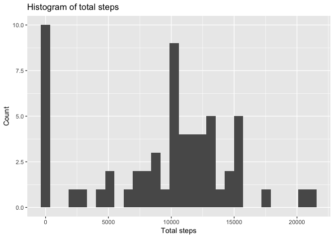
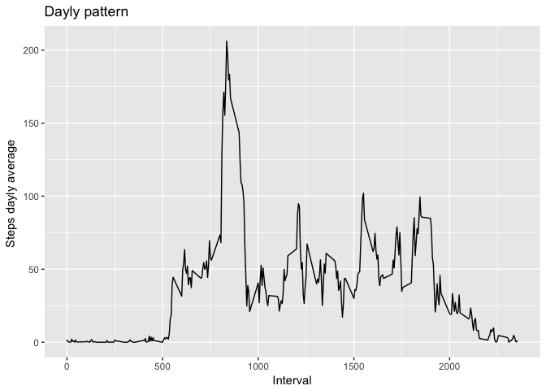
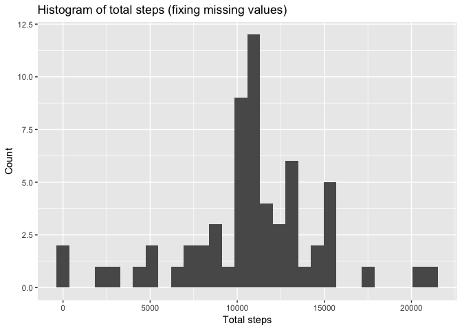
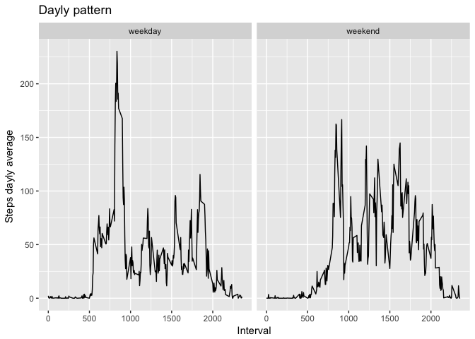

# Reproducible Research: Peer Assessment 1


## Loading and preprocessing the data
First check if everything is ok and load the data:


```r
# make sure "activity.csv" is in the current directory
getwd()
```

```
## [1] "/Users/gholler/data scentist/activity monitoring"
```

```r
list.files()
```

```
## [1] "Activity monitoring.Rmd"       "Activity_monitoring.html"     
## [3] "activity.csv"                  "PA1_template.Rmd"             
## [5] "repdata%2Fdata%2Factivity.zip"
```

```r
activity <- read.csv("activity.csv")
```


## What is mean total number of steps taken per day?
Following code computes the histogram of the total number of steps taken each day, ignoring NA values:


```r
total_steps_per_day <- activity %>%
    group_by(date) %>%
    summarise(total_steps = sum(steps, na.rm=TRUE))

g <- with(total_steps_per_day, ggplot(total_steps_per_day, aes(total_steps))) + 
    geom_histogram() +
    ggtitle("Histogram of total steps") + 
    labs(x="Total steps", y="Count")

print(g)
```

```
## `stat_bin()` using `bins = 30`. Pick better value with `binwidth`.
```

<!-- -->

Mean and median total number of steps taken per day:

```r
stats <- summary(total_steps_per_day$total_steps)
mean <- format(stats[4], digits = 5)
median <- format(stats[3], digits = 5)
```
+ Mean = 9354.2
+ Median = 10395


## What is the average daily activity pattern?


```r
ts_intervals <- activity %>%
    group_by(interval) %>%
    summarise(avg_steps = mean(steps, na.rm=TRUE))

g <- with(ts_intervals, ggplot(ts_intervals, aes(interval, avg_steps))) +
    geom_line()+
    ggtitle("Dayly pattern") + 
    labs(x="Interval", y="Steps dayly average ")

print(g)
```

<!-- -->


## Imputing missing values
ust ignoring missing values could lead to biased conclusions. 
The following code evaluate the total number of missing values (NA)
in the dataset

```r
missing_values <-  nrow(activity[is.na(activity$steps), ])
total <- nrow(activity)
proportion <- format(missing_values*100 / total, digit = 2, nsmall = 2)

print(missing_values)
```

```
## [1] 2304
```

So that there are 13.11% missing values.

It could be interesting to use the mean of the corresponding interval
(which we just computed) instead of a missing value.
The following code just implements this strategy:


```r
activity_fixed <- activity %>%
    merge(ts_intervals, by="interval") 


activity_fixed <- mutate(activity_fixed, steps =  ifelse(is.na(steps),
                                     avg_steps,
                                     steps))
activity_fixed <- select(activity_fixed, -avg_steps )
```
Let's view the corrected histogram of total number of steps per day:


```r
total_steps_per_day_fixed <- activity_fixed %>%
    group_by(date) %>%
    summarise(total_steps = sum(steps, na.rm=TRUE))

g <- with(total_steps_per_day_fixed, ggplot(total_steps_per_day_fixed,
                                            aes(total_steps))) + 
    geom_histogram() +
    ggtitle("Histogram of total steps (fixing missing values)") + 
    labs(x="Total steps", y="Count")

print(g)
```

```
## `stat_bin()` using `bins = 30`. Pick better value with `binwidth`.
```

<!-- -->

Corrected mean and median total number of steps taken per day:

```r
stats <- summary(total_steps_per_day_fixed$total_steps)
mean <- format(stats[4], digits = 5)
median <- format(stats[3], digits = 5)
```
+ Mean = 10766
+ Median = 10766


## Are there differences in activity patterns between weekdays and weekends?
It is expectable to see a variation of activity patterns between days and weekends.
Let's confirm this and characterise the variation, using the corrected dataset:


```r
# I18N issue : set locale to a fixed value
Sys.setlocale(locale="en_US")
```

```
## [1] "en_US/en_US/en_US/C/en_US/fr_FR.UTF-8"
```

```r
activity_fixed <- activity_fixed %>%
    mutate(day_type = ifelse(weekdays(as.Date(date)) %in% c("Saturday", "Sunday"),
                             "weekend","weekday"))


#plot the time series side by side

ts_intervals_fixed <- activity_fixed %>%
    group_by(interval, day_type) %>%
    summarise(avg_steps = mean(steps, na.rm=TRUE))

g <- with(ts_intervals_fixed, ggplot(ts_intervals_fixed, aes(interval, avg_steps))) +
    geom_line()+
    facet_grid(. ~ day_type) +
    ggtitle("Dayly pattern") + 
    labs(x="Interval", y="Steps dayly average ")

print(g)
```

<!-- -->
